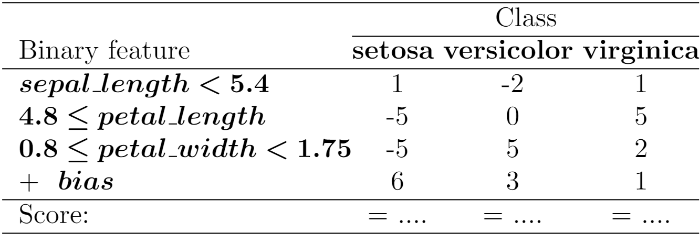

# MISS
This is a repository containing the code to generate Multiclass Interpretable Scoring Systems (MISS) as the one below:



### Installation

To use MISS, clone the repository and install all the required libraries:
```shell
pip install -r requirements.txt
```


Then, install risk-slim with multiclass extensions:
```shell
cd risk-slim
pip install -e .
```

### Usage
You can run the example MISS training with:
```shell
cd miss
python miss_example.py
```

This will create a multiclass scoring system based on the iris dataset.

You can train your own scoring systems with scikit-learn compatible api:
```python
from miss.models import MISSClassifier

mcrsc = MISSClassifier(
    mc_l0_min=0,
    mc_l0_max=3,
    max_coefficient=5,
    max_intercept=10
)

x_train = #... load dataset with binary features
y_train = #... pandas dataframe with 0, ..., K-1 values

mcrsc.fit(x_train, y_train)
```


### References
The implementation of risk-slim is taken from the original [risk-slim repository](https://github.com/ustunb/risk-slim). 
We have broadened the implementation to enable Multiclass (mc) scoring systems generation.

Among the most important papers that helped during the implemenation of this project we have to name:
```
@article{ustun2019jmlr,
  author  = {Ustun, Berk and Rudin, Cynthia},
  title   = {{Learning Optimized Risk Scores}},
  journal = {{Journal of Machine Learning Research}},
  year    = {2019},
  volume  = {20},
  number  = {150},
  pages   = {1-75},
  url     = {http://jmlr.org/papers/v20/18-615.html}
}

@inproceedings{pajor2022effect,
  title={Effect of Feature Discretization on Classification Performance of Explainable Scoring-Based Machine Learning Model},
  author={Pajor, Arkadiusz and {\.Z}o{\l}nierek, Jakub and Sniezynski, Bartlomiej and Sitek, Arkadiusz},
  booktitle={International Conference on Computational Science},
  pages={92--105},
  year={2022},
  organization={Springer}
}
```
